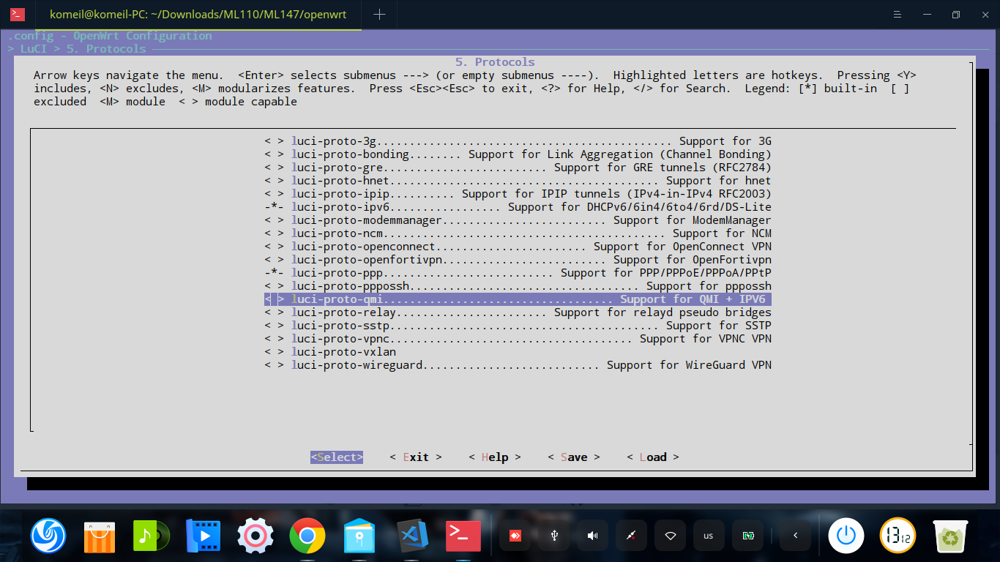

OpenWrt with Personal improvements
Changes made : 
1-  rtw88 Driver Support RTL8822CU AP Mode 
2-  qmi Driver with Support IPV6

To use the leanotek-rtw88 package, it is enough from the section
`make menuconfig`
Enter the config section and in the section
Kernel modules ---> Wireless Drivers
Select the kmod-rtw88-usb-leanotek package
and 
LuCI ---> Protocols ---> luci-proto-qmi-ipv6

I will write additional explanations about how to develop the driver and add access point mode whenever I have time :)
At the moment, this driver has not yet reached the final version

